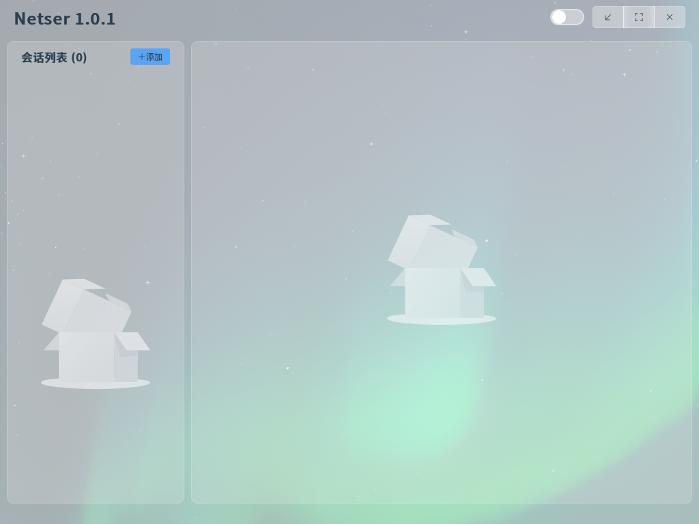
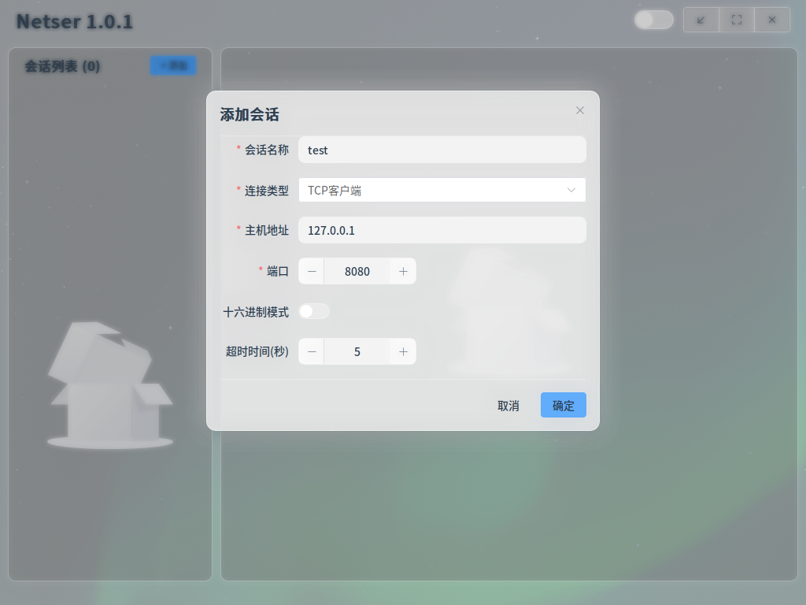
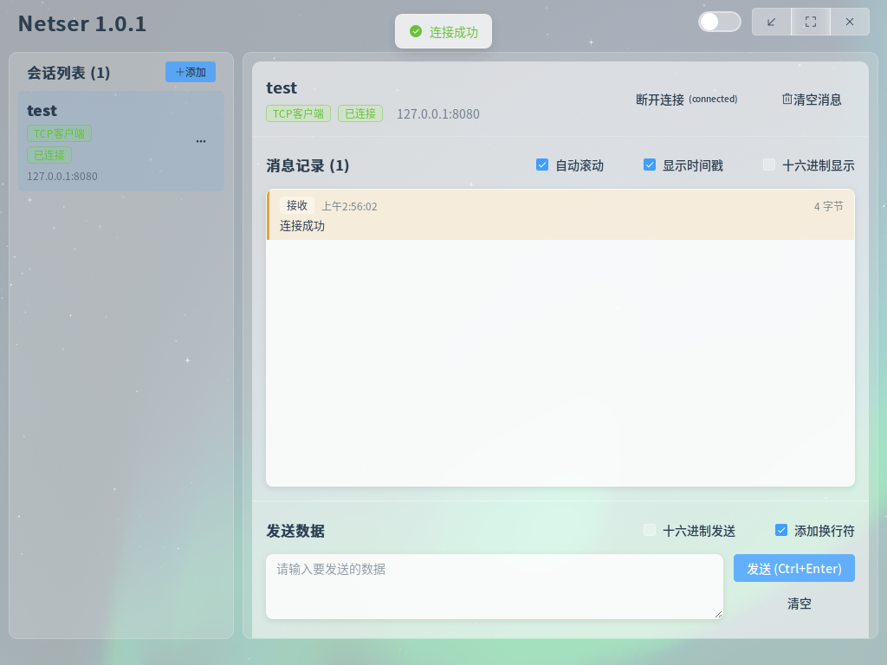

# Netser - 网络通信调试工具


一个现代化的网络通信调试工具，基于 [Wails](https://wails.io/) 框架开发，支持 TCP 和串口通信。

## 程序图片





## ✨ 功能特性

### 🌐 网络通信
- **TCP 客户端** - 连接到远程 TCP 服务器
- **TCP 服务端** - 创建 TCP 服务器监听连接
- **实时数据收发** - 双向数据传输，支持文本和十六进制格式
- **连接管理** - 会话管理，支持多个并发连接

### 🔌 串口通信
- **串口支持** - 支持各种串口设备通信
- **灵活配置** - 波特率、数据位、停止位、奇偶校验全面配置
- **自动检测** - 自动检测系统可用串口
- **实时监控** - 实时显示串口数据收发

### 💾 数据管理
- **消息持久化** - 基于 BoltDB 的嵌入式数据库存储
- **消息历史** - 完整的发送接收记录
- **会话管理** - 独立的会话数据库文件
- **自动清理** - 会话关闭时自动清理数据

### 🚀 实时通信
- **WebSocket 支持** - 实时消息推送
- **状态同步** - 连接状态实时更新
- **高性能** - 基于 Go 协程的并发处理

### 🎨 用户界面
- **现代化设计** - 基于 Vue 3 + Element Plus
- **响应式布局** - 适配不同屏幕尺寸
- **主题支持** - 美观的界面设计
- **操作便捷** - 直观的用户交互

## 🚀 快速开始

### 环境要求
- Go 1.18 或更高版本
- Node.js 16 或更高版本
- Wails v2

### 安装依赖

1. **安装 Wails CLI**
```bash
go install github.com/wailsapp/wails/v2/cmd/wails@latest
```

2. **克隆项目**
```bash
git clone https://github.com/zhoudm1743/Netser.git
cd Netser
```

3. **安装依赖**
```bash
# 安装 Go 依赖
go mod tidy

# 安装前端依赖
cd frontend
npm install
cd ..
```

### 开发模式运行

```bash
wails dev
```

应用将在开发模式下启动，支持热重载。

### 构建生产版本

```bash
wails build
```

构建完成后，可执行文件将在 `build/bin/` 目录下生成。

## 📖 使用指南

### TCP 通信

#### TCP 服务端
1. 点击"添加会话"
2. 选择"TCP 服务端"
3. 设置监听端口
4. 点击"连接"开始监听
5. 等待客户端连接

#### TCP 客户端
1. 点击"添加会话"
2. 选择"TCP 客户端"
3. 输入服务器地址和端口
4. 点击"连接"
5. 连接成功后即可收发数据

### 串口通信

1. 点击"添加会话"
2. 选择"串口"
3. 选择串口端口
4. 配置波特率、数据位、停止位、校验位
5. 点击"连接"
6. 连接成功后即可与串口设备通信

### 数据格式

- **文本模式** - 直接输入文本内容
- **十六进制模式** - 输入十六进制数据（如：48 65 6C 6C 6F）

## 🛠️ 技术架构

### 后端技术栈
- **Go** - 主要编程语言
- **Wails** - 桌面应用框架
- **Gorilla WebSocket** - WebSocket 通信
- **BoltDB** - 嵌入式数据库
- **go.bug.st/serial** - 串口通信库

### 前端技术栈
- **Vue 3** - 前端框架
- **Element Plus** - UI 组件库
- **Pinia** - 状态管理
- **Vite** - 构建工具

### 核心组件
- **Session Manager** - 会话管理器
- **TCP Manager** - TCP 连接管理器
- **Serial Manager** - 串口管理器
- **WebSocket Manager** - WebSocket 服务器
- **Message DB** - 消息数据库管理器

## 📁 项目结构

```
Netser/
├── app.go                 # 应用主逻辑
├── main.go               # 程序入口
├── core/                 # 核心功能模块
│   ├── session_manager.go    # 会话管理
│   ├── tcp_manager.go        # TCP 管理
│   ├── serial_manager.go     # 串口管理
│   ├── websocket_manager.go  # WebSocket 管理
│   ├── websocket_client.go   # WebSocket 客户端
│   └── message_db.go         # 消息数据库
├── dto/                  # 数据传输对象
│   ├── base.go              # 基础响应结构
│   ├── session/             # 会话相关 DTO
│   ├── tcp/                 # TCP 相关 DTO
│   └── websocket/           # WebSocket 协议
├── router/               # 路由处理
│   └── main.go
├── frontend/             # 前端代码
│   ├── src/
│   │   ├── components/      # Vue 组件
│   │   ├── stores/          # Pinia 状态管理
│   │   ├── dto/             # 前端 DTO
│   │   └── assets/          # 静态资源
│   └── package.json
├── go.mod               # Go 模块定义
├── go.sum               # Go 依赖校验
├── wails.json           # Wails 配置文件
└── README.md            # 项目说明
```

## 🔧 开发说明

### 添加新功能

1. **后端功能**
   - 在 `core/` 目录下添加管理器
   - 在 `dto/` 目录下定义数据结构
   - 在 `router/main.go` 中添加路由处理

2. **前端功能**
   - 在 `frontend/src/components/` 下添加组件
   - 在 `frontend/src/stores/` 中管理状态
   - 在 `frontend/src/dto/` 中定义前端数据结构

### 调试技巧

- 使用 `wails dev` 开启开发者工具
- 查看控制台日志了解应用状态
- 使用浏览器开发者工具调试前端

## 📦 发布版本

### 支持平台
- Windows (amd64, arm64)
- macOS (amd64, arm64)
- Linux (amd64, arm64)

### 交叉编译
```bash
# Windows
wails build -platform windows/amd64
wails build -platform windows/arm64

# macOS
wails build -platform darwin/amd64
wails build -platform darwin/arm64

# Linux
wails build -platform linux/amd64
wails build -platform linux/arm64
```

## 🤝 贡献指南

1. Fork 本仓库
2. 创建你的特性分支 (`git checkout -b feature/AmazingFeature`)
3. 提交你的更改 (`git commit -m 'Add some AmazingFeature'`)
4. 推送到分支 (`git push origin feature/AmazingFeature`)
5. 打开一个 Pull Request

## 📄 许可证

本项目采用 MIT 许可证 - 查看 [LICENSE](LICENSE) 文件了解详情。

## 🙏 致谢

- [Wails](https://wails.io/) - 优秀的 Go 桌面应用框架
- [Vue.js](https://vuejs.org/) - 渐进式 JavaScript 框架
- [Element Plus](https://element-plus.org/) - Vue 3 组件库
- [BoltDB](https://github.com/etcd-io/bbolt) - 嵌入式键值数据库

## 📞 联系方式

- GitHub: [zhoudm1743](https://github.com/zhoudm1743)
- Issues: [GitHub Issues](https://github.com/zhoudm1743/Netser/issues)

---

⭐ 如果这个项目对你有帮助，请给它一个 Star！
